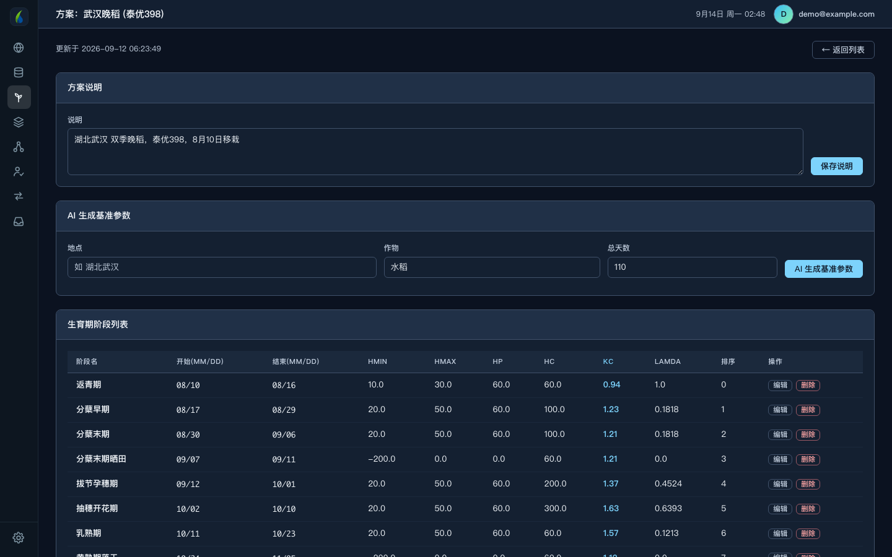
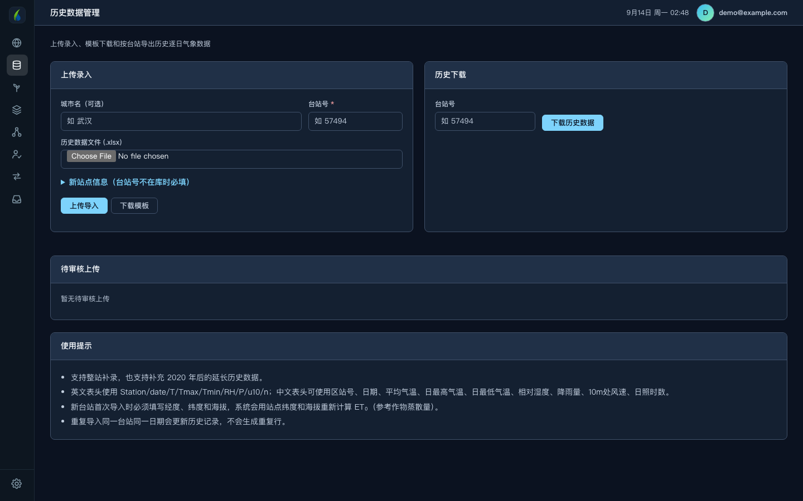
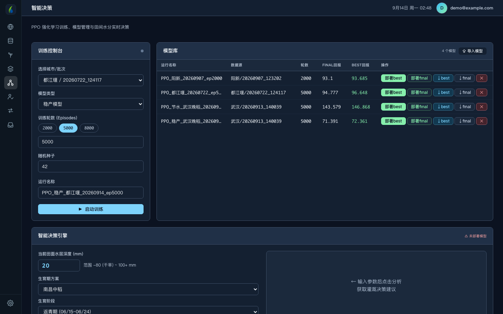
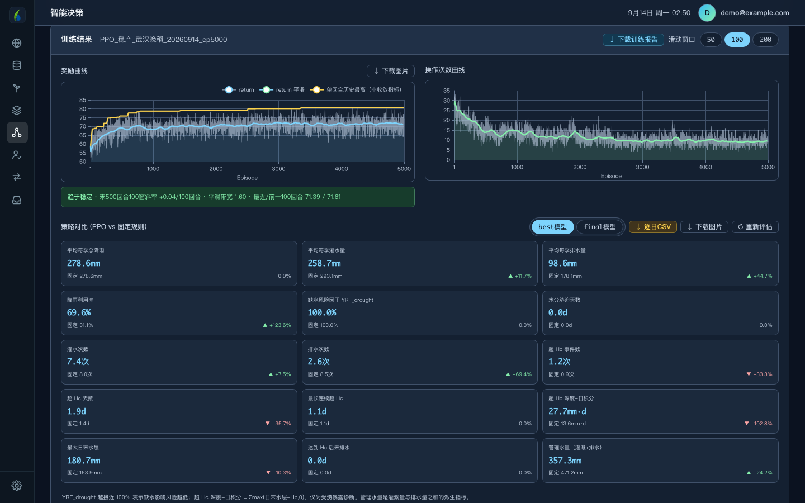
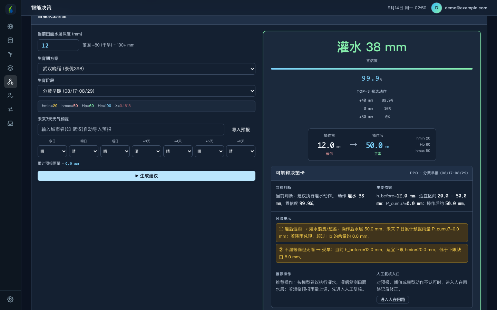
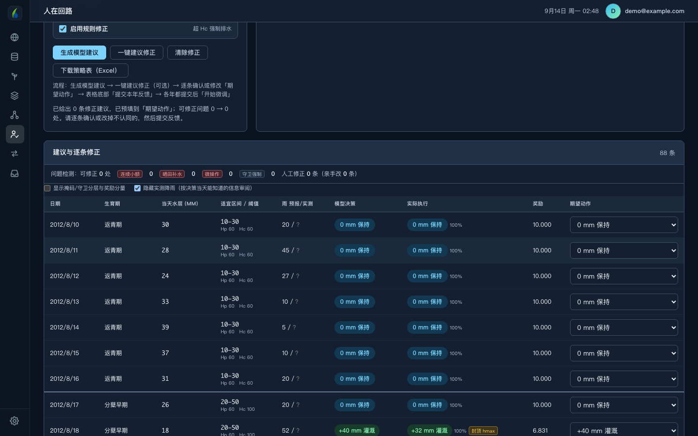
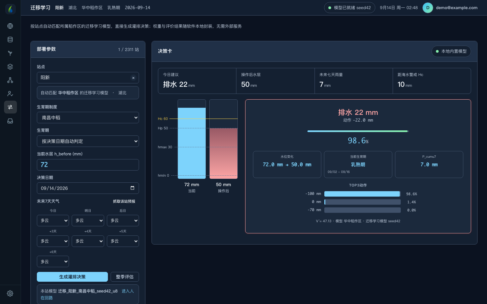
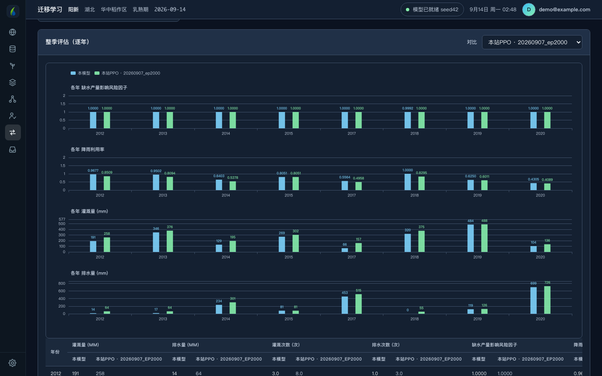
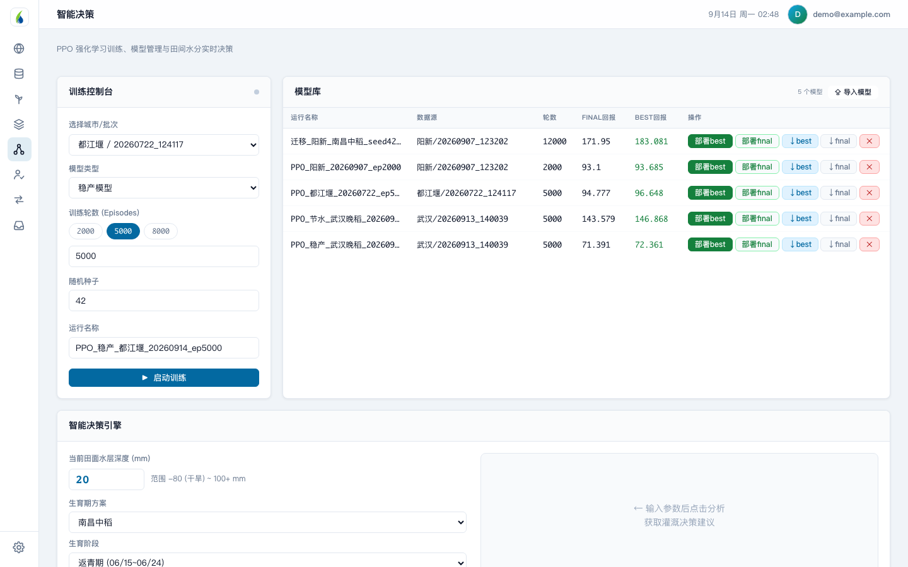

<div align="center">

# 智灌珈田

**水稻灌排智能决策平台**

从数据准备到模型训练，从智能决策到人工复核，<br>
一套软件走完稻田水管理的完整链路。

[](../../releases/latest)
[](https://app.paddy-intelligence.xyz)

武汉大学 · 节水灌溉及其生态环境效应研究团队

</div>

> **网页版用来快速试用和查看数据，训练模型请下载本地软件。**
> 网页版的训练跑在服务器上，多人同时训练会互相排队；本地软件用你自己电脑的算力，
> 训练不排队，数据和模型也都留在本机。详见[网页版还是本地软件](#网页版还是本地软件)。

---

## v1.0.3 更新了什么

- 训练可选两种模型
- 人在回路可下载策略表（Excel）
- 迁移学习更贴近本站
- 浅色模式更完整
- 导航顺序调整
- 水分胁迫天数统计调整

---

## 它解决什么问题

稻田管水的核心是一个数：**田面水层深度**。它必须待在适宜区间内——低了缺水影响灌浆，高了淹水伤根系、影响成穗。

难点在于今天的决定要考虑未来几天的雨。现在灌满，三天后一场大雨就漫过警戒线；现在不灌，可能撑不到下一场雨。传统做法按固定水层规则管理——遇雨则排、见干则灌，不看预报。

这套软件用强化学习把未来七天降雨预报纳入当天决策，在不增加缺水风险的前提下减少灌溉与排水。

---

# 怎么用

下面按实际使用顺序走一遍，左侧导航从上到下基本就是这个顺序。

## 第一步 · 总览：看哪些站点能训练

打开软件先到**总览**。全国气象台站的数据可用状态一目了然，按省份填色下钻，可切换「区域填色 / 城市点位 / 站点点位」三个图层。

<div align="center">

</div>

绿色是**可训练**（历史气象和天气预报都齐全），其余颜色分别表示缺历史、缺预报、两者都缺。想训练哪个站，先在这里确认它有数据。

下方的「城市台站速查」可按省份列出全部台站的台站号、站名、状态和数据年份范围。

---

## 第二步 · 生育期方案：定好每个阶段的水层

模型怎么管水，取决于每个生育期的水层参数。**生育期方案**页维护这些参数，一个方案对应一个地区、一个品种、一季稻。

<div align="center">

</div>

每个阶段包括：

| 参数 | 含义 |
|---|---|
| 开始 / 结束 | 阶段起止日期（月/日） |
| hmin / hmax | 适宜水层下限 / 上限（mm）：低于 hmin 需要灌水，灌到 hmax 为止 |
| Hp | 雨后蓄水上限，超过应排水 |
| Hc | 受涝警戒水层，超过会影响产量 |
| Kc | 作物系数，用来计算作物需水 |
| λ | 该阶段对缺水的敏感程度；晒田、黄熟落干期为 0 |

- 阶段名称从下拉框选择（返青期、分蘖早期……），同一方案里已有的阶段不能重复添加。
- 「AI 生成基准参数」可以按地点和作物先生成一版参考值，再手动修改。

---

## 第三步 · 生成训练数据

选好站点和生育期方案后，在总览下方生成训练文件。

<div align="center">

</div>

训练数据统一用 **Richardson WGEN 天气发生器**生成：按站点全部历史生育季拟合逐月干湿日转移概率、湿日雨量（Gamma 分布）和 ET₀，合成大量独立的气象序列用于训练。历史真实年份单独保留，**只用来评估，不进入训练**。

**支持多站点同时生成**。在「批量生成」区连续输入站名添加到列表，一次提交，后台排队处理，进度实时可见。2059 个城市任选。

### 检查生成报告

生成完到**数据生成**页核对，确认无误再拿去训练。

<div align="center">

</div>

每条记录都标明原始多少行、训练用多少行、有多少缺失。可下载的文件包括：

- `训练actual` / `训练forecast` —— WGEN 合成的训练数据
- `评估actual` / `评估forecast` —— 未经合成的真实序列，用于逐年评估
- `growth_para` —— 生育期参数
- `生成统计` / `方法说明` / `missing` —— 年份覆盖率、生成方法记录、缺失明细
- `WGEN参数` —— 逐月拟合参数

**重点看 `missing` 和年份覆盖率**。某年覆盖率不足 70% 时软件会提示，可以在生成时勾掉那些年份。

---

## 第四步 · 历史数据：补录或下载气象数据

<div align="center">

</div>

- **上传录入**：下载模板，按 `Station/date/T/Tmax/Tmin/RH/P/u10/n`（或对应的中文表头：区站号、日期、平均气温……）填好后上传。新台站首次导入需要填经纬度和海拔，系统会据此计算 ET₀。
- 重复导入同一台站同一日期会更新原记录，不会生成重复行。

---

## 第五步 · 训练模型：稳产模型与节水模型

数据没问题后进**智能决策**，选批次和**模型类型**，设训练轮数（2000 / 5000 / 8000 或自填）和随机种子，启动 PPO 训练。

<div align="center">

</div>

| 模型类型 | 适合 | 特点 |
|---|---|---|
| **稳产模型**（默认） | 优先保证产量 | 严格守住适宜水层，灌溉次数相对多、每次水量相对少 |
| **节水模型** | 希望省水、少下田操作 | 奖励里对每次灌排操作和用水量扣分，倾向于少次、每次多灌，总用水更少 |

两种模型只是奖励不同，其他训练设置完全一样。以武汉晚稻（泰优398）为例，训练 5000 回合、用历史真实年份逐年评估的平均值：

| | 灌水量 | 排水量 | 灌溉次数 | 缺水风险因子 |
|---|---|---|---|---|
| 固定水层规则 | 293 mm | 178 mm | 8.0 次 | 100% |
| 稳产模型 | 259 mm | 99 mm | 7.4 次 | 100% |
| 节水模型 | 224 mm | 67 mm | 4.1 次 | 100% |

> 不同站点效果会有差别，建议两种都训练，在整季评估里比较后再选用。

> **这一步建议用本地软件。** 网页版的训练跑在服务器上，多人同时训练会排队；本地软件用你自己电脑的算力。5000 回合在普通笔记本上约需十几分钟。

<div align="center">

</div>

训练全过程可视：

- **奖励曲线** —— 逐回合回报、平滑曲线、历史最高
- **操作次数曲线** —— 灌排动作次数随训练下降的过程
- **收敛诊断** —— 末段斜率、平滑带宽、前后百回合对比，自动判断是否趋于稳定
- **策略对比** —— 十余项指标与固定水层规则并排：灌溉量、排水量、灌排次数、降雨利用率、缺水风险因子、水分胁迫天数、超 Hc 天数与深度–日积分、管理水量等，每项标出相对变化；可在 best / final 模型之间切换

**结果的应用与下载**：训练好的模型进入模型库，可「部署best」或「部署final」用于实时决策；可下载 `best` / `final` 权重、逐日评估 CSV、图表图片，以及一份完整的 **Word 训练报告**。

**智能助手**：页面里的对话框可就农田水利、天气、灌溉决策提问，支持上传附件。

---

## 第六步 · 智能决策引擎：今天该怎么灌

部署模型后，下面的**智能决策引擎**就用这个模型出建议：填当前田面水层，选生育期方案和阶段，填未来七天天气（也可以输入城市自动导入预报），点「生成建议」。

<div align="center">

</div>

上图：武汉晚稻分蘖早期，当前水层 12 mm，低于适宜下限 20 mm，模型建议**灌水 38 mm** 到 50 mm。右侧给出：

- 结论与置信度、Top-3 候选动作、操作前后水层；
- **可解释决策卡**：当前判断、主要依据、风险提示（灌后遇雨、不灌等雨但无雨）、推荐操作；
- 不认可时可以直接「进入人在回路」记录修正。

---

## 第七步 · 人在回路：把你的经验喂回模型

模型再好也不一定完全贴合本地实际。**人在回路**页让你逐日核对模型建议，把修正意见反馈给模型。

<div align="center">

</div>

1. **生成模型建议**：选模型和年份，填**初始水层**（这一季开始时田里的水层），表格逐日列出当天水层、适宜区间、预报/实测雨量、模型决策、实际执行和奖励。
2. **问题检测**：自动标出不合理操作——连续小额、晒田补水、微操作、守卫强制。点「一键建议修正」会把修正建议预填到「期望动作」，每改一处都按修正后的动作重算后面的水层。
3. **提交反馈与微调**：逐条确认或修改「期望动作」，提交本年反馈；各年都提交后「开始微调」，完成后自动生成**固定规则、原模型、微调后**三方对比，可导出报告。
4. **下载策略表（Excel）**：按填写的初始水层和所选年份（或全部年份）导出逐日策略，包含「逐日策略」「逐年汇总」「导出条件」三张表；表格里已经做的修正会一并算进去，方便线下核对和存档。

「启用规则修正」表示水层超过 Hc 时软件强制排水；想看模型自己的原始决策，可以取消勾选。勾选「显示掩码/守卫分层与奖励分量」可以展开更细的诊断。

---

## 第八步 · 没有数据的地方怎么办：迁移学习

不是每个站点都有完整的历史气象。**迁移学习**页内置全国六大稻作区（华南 / 华中 / 西南高原 / 华北 / 东北 / 西北）的 18 个预训练模型，**不用训练直接出决策**。

<div align="center">

</div>

**怎么用**：

1. 站点框直接打字，输入站名或省份，从下拉里选。**全国 2311 个台站都支持**，不在名册内的按地理最近邻自动归区
2. 「生育期制度」与「生育期方案」页同步，默认用该站所在地区的方案，也可以换
3. 填当前田面水层、决策日期，未来七天天气可手选，也可点「抓取该站预报」
4. 点「生成灌排决策」

上图：阳新站当前水层 72 mm，模型建议**排水 22 mm** 降到 50 mm。左边标尺画出 hmin / hmax / Hp / Hc 和操作前后的水层，右边给出置信度与候选动作概率——能看懂为什么这么建议，不是黑箱数字。

**建立本站模型**：选定站点和生育期方案后点「建立本站模型」，软件用该站同一方案的训练数据（没有会自动生成）把迁移学习模型保存为一个本站模型。它会出现在模型库里，可以进人在回路逐日查看、修正并微调，得到更贴合本站的新模型。

### 怎么看效果

点「整季评估」，用该站真实历史逐年回算，把迁移学习模型和对照策略并排比较。

<div align="center">

</div>

- 页面底部会标明这次用的是哪份数据（所选方案的本站数据，或论文站点数据）。
- 「对比」可选固定水层规则、预报排水规则（保守 / 中等 / 激进）；如果模型库里有用该站数据训练的 PPO 模型，还会出现「本站PPO」，可以直接比较迁移学习模型和本站训练的模型。
- 图表与逐年表格联动。

---

## 界面外观

默认深色。左下角齿轮里可以切换**深色模式**、**显示导航名称**、**侧栏布局**；切到浅色时，左侧导航栏和窗口标题栏一起变浅。

<div align="center">

</div>

---

# 网页版还是本地软件

两个都能用，但擅长的事情不同：

| | 网页版 | 本地软件 |
|---|---|---|
| 打开方式 | 浏览器直接用，不用安装 | 下载安装，约 200–240 MB |
| 查看站点数据、地图 | ✅ | ✅ |
| 智能决策、迁移学习决策、整季评估 | ✅ | ✅ |
| **训练 PPO 模型** | ⚠️ **跑在服务器上，多人同时训练会排队甚至卡住** | ✅ **用本机算力，不排队** |
| 数据生成（尤其批量多站点） | ⚠️ 同上，占用服务器 | ✅ 本机跑 |
| 人在回路微调 | ⚠️ 同上 | ✅ 本机跑 |
| 训练结果存放 | 服务器 | 你自己的电脑 |

**结论**：只是想看看效果、查数据、出几条灌排决策 —— 用[网页版](https://app.paddy-intelligence.xyz)最省事。

**要训练模型、批量生成数据、做人在回路微调 —— 请下载本地软件。** 这些是重计算任务，服务器是单机部署的，几个人同时跑就会互相拖慢。本地软件把计算放在你自己机器上，跑多久都不影响别人，也不受服务器负载影响。

---

# 下载安装

到 [**Releases**](../../releases/latest) 页下载对应系统的安装包。

| 系统 | 文件 | 说明 |
|---|---|---|
| macOS (Apple Silicon) | `CropRLDecision-macOS-arm64.zip` | 解压后打开 `智灌珈田.app` |
| Windows x64 | `CropRLDecision-Setup.exe` | 双击安装（**推荐**），自动创建桌面与开始菜单快捷方式 |
| Windows x64 | `CropRLDecision-Windows-x64.zip` | 免安装，解压后运行 `CropRLDecision.exe` |

## 首次打开被系统拦下？属正常现象

本软件为科研非商业软件，未购买苹果 / 微软的代码签名，**首次打开会被系统拦一下，放行一次即可**，之后不再提示。

### macOS

双击 `智灌珈田.app`，若提示「未打开"智灌珈田"，Apple 无法验证是否包含恶意软件」：

打开 **系统设置 → 隐私与安全性**，滚动到底部找到关于"智灌珈田"的提示，点 **「仍要打开」**，在弹窗里再点一次 **「打开」**。

> 旧版 macOS 也可直接在 `智灌珈田.app` 上**右键 →「打开」→ 弹窗里点「打开」**。

### Windows

**用安装版 `CropRLDecision-Setup.exe` 不受下面的问题影响，推荐优先选它。**

若用 `…-Windows-x64.zip` 免安装版，从网上下载的压缩包会被系统标记为"来自网络"，可能导致程序无法启动。

**推荐做法：解压前**先在下载好的 `.zip` 上**右键 → 属性 → 勾选「解除锁定 (Unblock)」→ 确定**，再解压。

软件启动时也会自动尝试解除该标记。万一仍报 `Failed to resolve Python.Runtime.Loader.Initialize` 之类错误，用 PowerShell 对解压目录执行一次：

```powershell
Get-ChildItem -Path '解压目录' -Recurse | Unblock-File
```

或改用安装版。

**Windows 窗口空白**：安装 [Microsoft Edge WebView2 Runtime](https://developer.microsoft.com/microsoft-edge/webview2/) 后重开。SmartScreen 提示时选「更多信息 → 仍要运行」。

---

# 账号

- **注册**：首次使用在登录页点「创建账号」，填邮箱、显示名与密码。注册成功自动登录。
- **忘记密码**：登录页点「忘记密码？」，输入注册邮箱，系统会把**重置密码的链接**发到该邮箱，30 分钟内有效，点开后设置新密码。
- **修改密码 / 头像**：在「账户设置」中随时修改。

首次启动需约 20 秒准备本地数据库。**无需自行配置任何密钥或路径。**

软件自带 2311 个台站的基础信息和全部迁移学习模型权重，**离线状态下当日灌排决策照常可用**。

---

# 你的数据存在哪

训练好的模型、生成的训练文件、人在回路标注都保存在本机：

- **macOS**：`~/Library/Application Support/CropRLDecision/`
- **Windows**：`%APPDATA%\CropRLDecision\`

**卸载或升级软件都不会删除这个目录**，重装后模型和训练结果仍在。需要备份或换机器时，整个目录拷走即可。

---

# 常见问题

**登录提示「邮箱或密码错误」** — 核对邮箱与密码（区分大小写、注意结尾特殊字符）。忘记密码可用登录页「忘记密码？」找回。

**登录提示 SSL / `UNEXPECTED_EOF` / 连接被关闭 / 超时** — 多为本机 **VPN / 代理**（尤其 TUN、全局、fake-ip 模式）干扰了到服务器的加密连接。请在代理软件里把 `paddy-intelligence.xyz` 设为**直连 (DIRECT)**，或使用本软件时**临时关闭代理**后重试。

**Windows 窗口空白** — 安装 Microsoft Edge WebView2 Runtime 后重开。

**macOS 提示「Apple 无法验证」打不开** / **Windows 报 `Failed to resolve Python.Runtime.Loader.Initialize`** — 均为未签名或下载文件被系统拦截所致，按上方[首次打开](#首次打开被系统拦下属正常现象)放行一次即可。

**稳产模型和节水模型该选哪个** — 优先保产量选稳产模型；想省水、少下田操作选节水模型。不确定时两种都训练，在整季评估里比较。

**下载文件时没有反应** — 本地软件会弹出系统的保存对话框，选好位置保存即可；如果对话框被其他窗口挡住，切换一下窗口。

**智能助手提示次数用完** — 每日有使用额度，次日自动恢复。

**整季评估提示「暂无历史逐日数据」** — 该站点本地没有历史序列，当日灌排决策不受影响。

---

# 指标说明

软件中几个指标的名称需要准确理解，请勿误用：

| 指标 | 含义 |
|---|---|
| `YRF_drought` | **缺水产量影响风险因子**，越接近 100% 表示缺水影响风险越低。**不是实测产量** |
| `Fs` | **受涝产量影响风险敏感性**。**不是实测产量** |
| 水分胁迫天数 | 田间缺水、作物耗水受限的天数，只统计对产量敏感的生育期（不含晒田、黄熟落干期） |
| 超 Hc 深度–日积分 | Σmax(日末水层 − Hc, 0)，受涝暴露的诊断量 |
| 管理水量 | 灌溉量与排水量之和的派生指标 |
| ET₀ | 参考作物蒸散量 |

决策建议仅供参考，实际灌排请结合田间实况与当地农技指导。

---

# 引用

<!-- TODO: 论文发表后在此补充完整引用信息与 BibTeX -->

相关论文正在整理中，发表后将在此提供引用格式。

如在研究中使用本软件，暂请注明：

> 智灌珈田 · 水稻灌排智能决策平台，武汉大学节水灌溉及其生态环境效应研究团队。

---

# 关于

由**武汉大学节水灌溉及其生态环境效应研究团队**开发。

作者：华克骥 · <huakeji2000@whu.edu.cn>

许可：仅限学习、科研和非商业评估使用。
