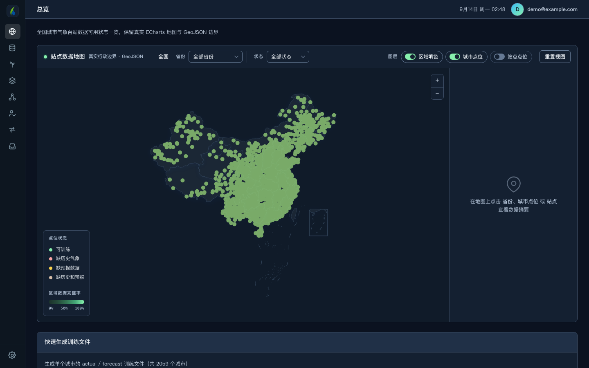
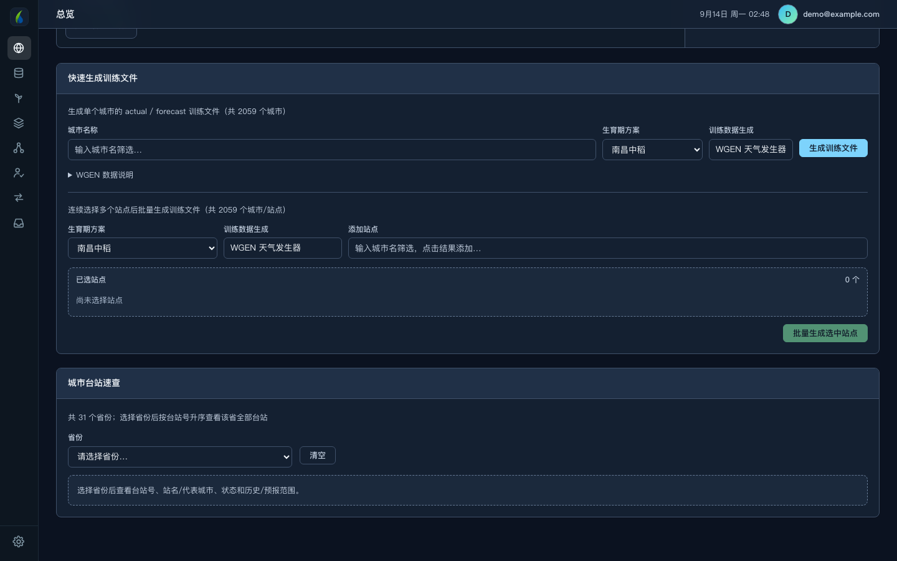
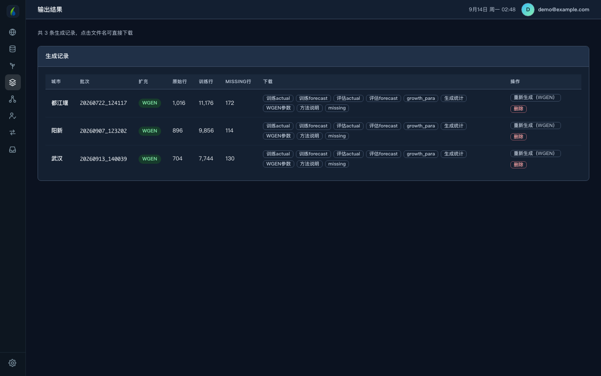
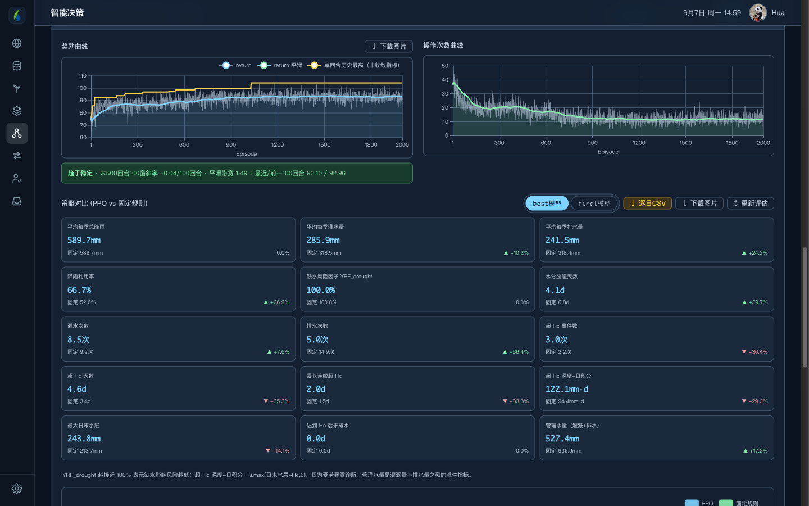
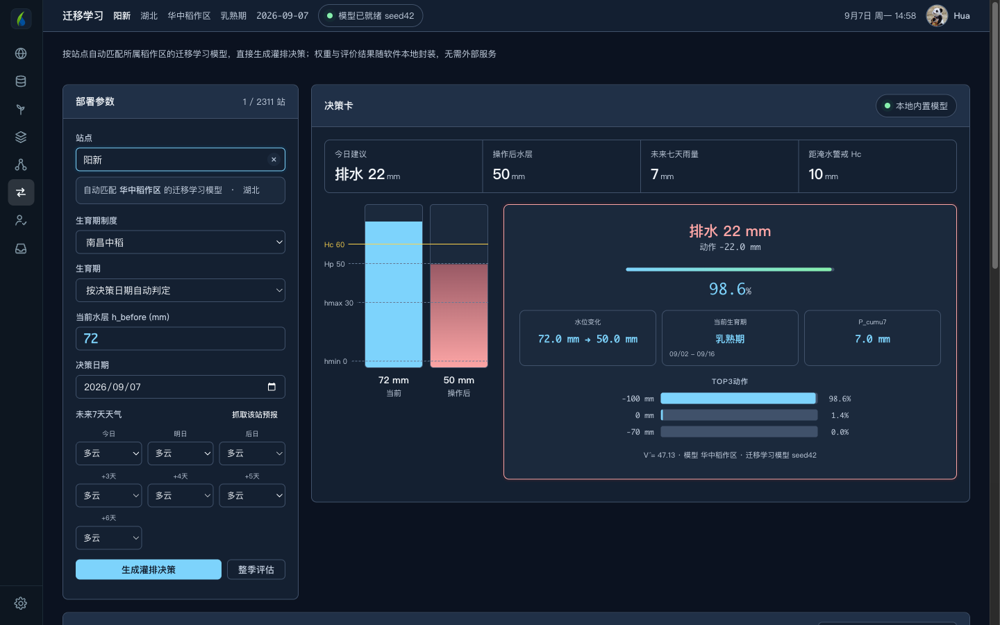
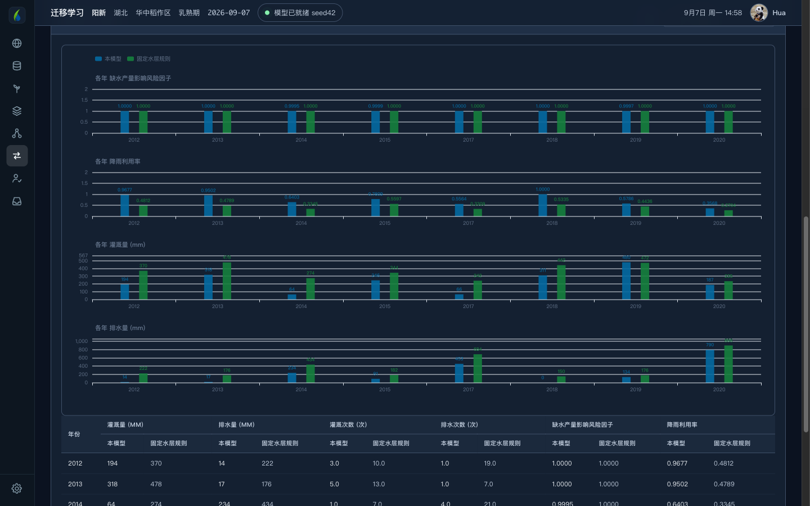
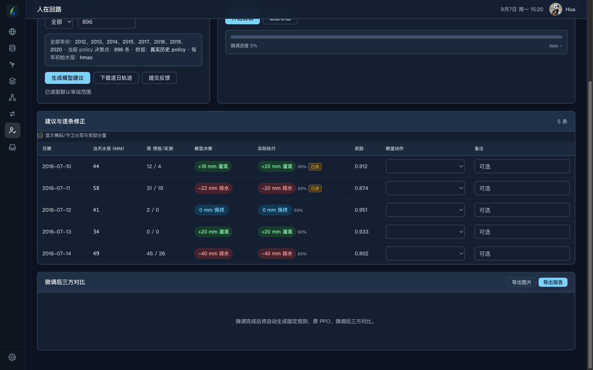

# 智灌珈田

**水稻灌排智能决策平台**

从数据准备到模型训练，从智能决策到人工复核， 
一套软件走完稻田水管理的完整链路。

武汉大学 · 节水灌溉及其生态环境效应研究团队

---

## 它解决什么问题

稻田管水的核心是一个数：**田面水层深度**。它必须待在适宜区间内——低了缺水影响灌浆，高了淹水伤根系、影响成穗。

难点在于今天的决定要考虑未来几天的雨。现在灌满，三天后一场大雨就漫过警戒线；现在不灌，可能撑不到下一场雨。传统做法按固定水层规则管理——遇雨则排、见干则灌，不看预报。

这套软件用强化学习把未来七天降雨预报纳入当天决策，在不增加缺水风险的前提下减少灌溉与排水。

---

# 怎么用

下面按实际使用顺序走一遍。

## 第一步 · 总览：看哪些站点能训练

打开软件先到**总览**。全国气象台站的数据可用状态一目了然，按省份填色下钻，可切换「区域填色 / 城市点位 / 站点点位」三个图层。

绿色是**可训练**（历史气象和天气预报都齐全），其余颜色分别表示缺历史、缺预报、两者都缺。想训练哪个站，先在这里确认它有数据。

下方的「城市台站速查」可按省份列出全部台站的台站号、站名、状态和数据年份范围。

---

## 第二步 · 生成训练数据

确认站点有数据后，在总览下方生成训练文件。

**两种增广方式**，按需选择：

| 方式 | 做法 | 适用 |
|---|---|---|
| **简单干湿增广** | 对真实年做 11 种情景变换（原样、+1～+5 mm、÷2～÷10） | 快速扩样，保持真实序列骨架 |
| **Richardson WGEN** | 按历史生育季拟合逐月干湿日转移概率，湿日雨量用 Gamma 分布，ET₀ 按历日均值与变异合成 | 需要更多独立气象序列时 |

**支持多站点同时生成**。在「批量生成」区连续输入站名添加到列表，一次提交，后台排队处理，进度实时可见。2059 个城市任选。

---

## 第三步 · 检查生成报告

生成完到**数据生成**页核对，确认无误再拿去训练。

每条记录都标明用的哪种增广、原始多少行、扩增后多少行、有多少缺失。可下载的文件包括：

- `训练actual` / `训练forecast` —— 增广后的训练数据
- `评估actual` / `评估forecast` —— 未经增广的真实序列，用于逐年评估
- `growth_para` —— 生育期参数
- `生成统计` / `方法说明` / `missing` —— 年份覆盖率、增广方法记录、缺失明细
- WGEN 方式额外产出 `WGEN参数`（逐月拟合参数）

**重点看 `missing` 和年份覆盖率**。某年覆盖率不足 70% 时软件会提示，可以在生成时勾掉那些年份。

---

## 第四步 · 训练模型并查看结果

数据没问题后进**智能决策**，选批次、设训练轮数（2000 / 5000 / 8000 或自填）和随机种子，启动 PPO 训练。

训练全过程可视：

- **奖励曲线** —— 逐回合回报、平滑曲线、历史最高
- **操作次数曲线** —— 灌排动作次数随训练下降的过程
- **收敛诊断** —— 末段斜率、平滑带宽、前后百回合对比，自动判断是否趋于稳定
- **策略对比** —— 十余项指标与固定水层规则并排：灌溉量、排水量、灌排次数、降雨利用率、缺水产量影响风险因子、超 Hc 天数与深度–日积分、管理水量等，每项标出相对变化

**结果的应用与下载**：训练好的模型进入模型库，点「部署best」即可用于实时决策；可下载 `best` / `final` 权重、逐日评估 CSV、图表 PNG，以及一份完整的 **Word 训练报告**。

**智能助手**：右下角的对话框可就农田水利问题提问，支持拖拽上传文档。普通研究员账号每天 3 次。

---

## 第五步 · 没有数据的地方怎么办：迁移学习

不是每个站点都有完整的历史气象。**迁移学习**页解决这个问题——内置全国六大稻作区（华南 / 华中 / 西南高原 / 华北 / 东北 / 西北）的 18 个预训练权重，**不用训练直接出决策**。

**怎么用**：

1. 站点框直接打字，输入站名或省份，从下拉里选。**全国 2311 个台站都支持**，不在名册内的按地理最近邻自动归区，不会出现"该站不可用"
2. 生育期制度可选，也可让软件按决策日期自动判定生育期
3. 填当前田面水层，未来七天天气可手选，也可点「抓取该站预报」自动获取
4. 点「生成灌排决策」

上图是阳新站的一次实际决策：当前水层 72 mm，模型建议**排水 22 mm**降到 50 mm。左边标尺画出 hmin / hmax / Hp / Hc 四条线和水层位置，右边给出置信度与候选动作概率——能看懂为什么这么建议，不是黑箱数字。

### 怎么看效果

点「整季评估」，用该站 2013–2020 的真实历史逐年回算，把模型和对照策略并排比较。

默认对比**固定水层规则**，也可切换到干湿交替灌溉、预报排水规则、预报灌排联合规则等。图表与表格联动，逐年可查。

---

## 第六步 · 人在回路：把你的经验喂回模型

模型再好也不一定完全贴合本地实际。**人在回路**页让你逐日核对模型建议与实际执行，把修正意见反馈给模型。

表格逐日列出当天水层、雨量（预报/实测）、模型决策、实际执行、奖励。模型决策与实际执行不同时标「已改」，便于快速定位分歧。

在「期望动作」列选出你认为正确的动作，加备注，提交反馈后启动**行为克隆微调**。微调完成自动生成**固定规则、原 PPO、微调后**三方对比，可导出图片与报告。

勾选「显示掩码/守卫分层与奖励分量」可展开更细的诊断：掩码后动作、安全守卫动作、规则/缺水/受涝/动作四项奖励分量、ET₀。

---

# 下载安装

到 [**Releases**](../../releases/latest) 页下载。

| 平台 | 文件 |
|---|---|
| macOS (Apple Silicon) | `CropRLDecision-macOS-arm64.zip` |
| Windows x64 · 安装版 | `CropRLDecision-Setup.exe` |
| Windows x64 · 免安装 | `CropRLDecision-Windows-x64.zip` |

**macOS 首次打开**：软件未经 Apple 公证，请**右键点图标 → 打开**，在弹窗中再点一次「打开」。直接双击会被系统拦下。

**Windows 白屏**：缺 Microsoft Edge WebView2 运行时，到微软官网搜索 "WebView2 Runtime" 安装即可。

**登录失败**：多与本机 VPN / 代理有关，可临时关闭代理后重试。

首次启动需约 20 秒准备本地数据库。在软件内注册账号即可使用，无需自行配置任何密钥；忘记密码可通过邮箱找回。

---

# 账号与数据权限

软件自带 2311 个台站的基础信息和全部迁移学习模型权重，**离线状态下当日灌排决策照常可用**。

历史气象数据用于整季评估、模型训练和数据生成，按账号角色开放：

| 角色 | 模型使用 | 历史数据下载 |
|---|---|---|
| 普通研究员 | ✅ 全部功能 | ❌ 不开放 |
| 管理员 | ✅ | 10 个台站 |
| 超级管理员 | ✅ | 不限 |

**普通研究员账号可以正常使用全部模型功能**（迁移学习决策、已有数据的训练与评估、人在回路），只是不能批量下载历史气象数据。

如需额外权限，请联系 **华克骥 · <huakeji2000@whu.edu.cn>**。

---

# 数据存放位置

- **macOS**：`~/Library/Application Support/CropRLDecision/`
- **Windows**：`%LOCALAPPDATA%\CropRLDecision\`

卸载软件不会删除此目录，你的模型、训练结果与人在回路标注都会保留。

---

# 指标说明

软件中几个指标的名称需要准确理解，请勿误用：

| 指标 | 含义 |
|---|---|
| `YRF_drought` | **缺水产量影响风险因子**，越接近 100% 表示缺水影响风险越低。**不是实测产量** |
| `Fs` | **受涝产量影响风险敏感性**。**不是实测产量** |
| 超 Hc 深度–日积分 | Σmax(日末水层 − Hc, 0)，受涝暴露的诊断量 |
| 管理水量 | 灌溉量与排水量之和的派生指标 |
| ET₀ | 参考作物蒸散量 |

决策建议仅供参考，实际灌排请结合田间实况与当地农技指导。

---

# 引用

<!-- TODO: 论文发表后在此补充完整引用信息与 BibTeX -->

相关论文正在整理中，发表后将在此提供引用格式。

如在研究中使用本软件，暂请注明：

> 智灌珈田 · 水稻灌排智能决策平台，武汉大学节水灌溉及其生态环境效应研究团队。

---

# 关于

由**武汉大学节水灌溉及其生态环境效应研究团队**开发。

作者：华克骥 · <huakeji2000@whu.edu.cn>

许可：仅限学习、科研和非商业评估使用。
