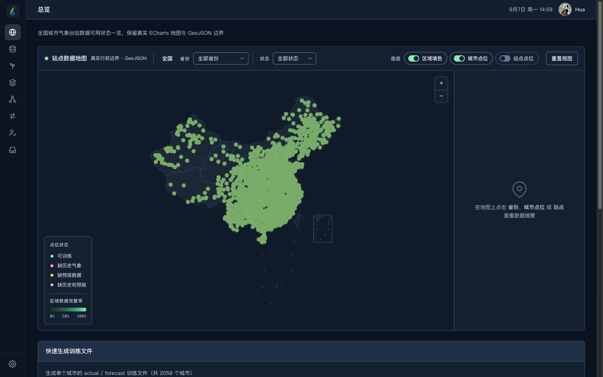

# 智灌珈田

**水稻灌排智能决策平台**

输入今天的田面水层和未来天气，告诉你该灌多少、该排多少。 
内置全国六大稻作区的预训练模型，2311 个气象台站开箱即用。

武汉大学 · 节水灌溉及其生态环境效应研究团队

---

## 它解决什么问题

稻田管水的核心是一个数：**田面水层深度**。它必须待在适宜区间内——低了缺水影响灌浆，高了淹水影响根系和成穗。难点在于今天的决定要考虑未来几天的雨：现在灌满，三天后一场大雨就漫过警戒线；现在不灌，可能撑不到下一场雨。

传统做法是按固定水层规则管理，遇雨则排、见干则灌。这套软件用强化学习模型替代固定规则，把未来七天降雨预报纳入当天决策，在不增加缺水风险的前提下减少灌溉和排水次数。

上图是阳新站的一次实际决策：当前水层 72 mm，模型建议**排水 22 mm**降到 50 mm。左边的标尺画出了 hmin / hmax / Hp / Hc 四条线和水层的位置，右边给出置信度和候选动作的概率分布——不是一个黑箱数字，而是能看懂为什么。

---

## 主要功能

### 迁移学习 · 不用训练就能用

内置六大稻作区（华南 / 华中 / 西南高原 / 华北 / 东北 / 西北）的 18 个预训练权重。选任意站点，软件按地理位置自动匹配所属稻作区的模型，直接出决策。

全国 **2311 个气象台站**都支持，不在名册内的站点按最近邻归区，不会出现"该站不可用"。

### 整季评估 · 拿八年历史检验

用 2013–2020 的真实历史逐年回算，把模型和固定水层规则并排比较：灌溉量、排水量、灌排次数、超 Hc 天数、缺水产量影响风险因子、降雨利用率。可切换对比对象（干湿交替灌溉、预报排水规则、预报灌排联合规则等）。

### 站点数据地图

全国气象台站的数据可用状态，按省份填色下钻，可切换区域填色 / 城市点位 / 站点点位三个图层。基于真实行政边界 GeoJSON。

### 自己训练与评估

用自己的数据训练 PPO 模型，全过程可视：奖励曲线、操作次数曲线、收敛诊断（末段斜率、平滑带宽、前后百回合对比），以及十余项指标的策略对比。

### 人在回路

逐日核对模型建议与实际执行，标注你认为正确的动作，把这些修正喂回去做行为克隆微调，得到贴合本地经验的模型。

### 数据生成

由历史气象与天气预报生成训练文件，支持两种方式：**简单干湿增广**（11 情景变换）和 **Richardson WGEN**（逐月干湿马尔可夫 + Gamma 雨量分布合成气象序列）。

### 智能助手

农田水利中文问答，可拖拽上传文档。免费账号每天 3 次。

### 其他

深色 / 亮色主题、侧栏与顶部导航两套布局可切换、顶栏实时天气与日期、训练报告导出 Word、逐日轨迹导出 CSV。

---

## 下载安装

到 [**Releases**](../../releases/latest) 页下载。

| 平台 | 文件 |
|---|---|
| macOS (Apple Silicon) | `CropRLDecision-macOS-arm64.zip` |
| Windows x64 · 安装版 | `CropRLDecision-Setup.exe` |
| Windows x64 · 免安装 | `CropRLDecision-Windows-x64.zip` |

**macOS 首次打开**：软件未经 Apple 公证，请**右键点图标 → 打开**，在弹窗中再点一次「打开」。直接双击会被系统拦下。

**Windows 白屏**：缺 Microsoft Edge WebView2 运行时，到微软官网搜索 "WebView2 Runtime" 安装即可。

**登录失败**：多与本机 VPN / 代理有关，可临时关闭代理后重试。

首次启动需要约 20 秒准备本地数据库。在软件内注册账号即可使用，无需自行配置任何密钥；忘记密码可通过邮箱找回。

---

## 数据权限

软件自带 2311 个台站的基础信息和全部模型权重，**离线状态下当日灌排决策照常可用**。

整季评估、模型训练、数据生成需要历史气象数据，这部分按账号角色开放：

| 角色 | 可下载的台站数 |
|---|---|
| 超级管理员 | 不限 |
| 管理员 | 10 个 |
| 普通用户 | 不开放 |

需要更高权限请联系管理员。

---

## 数据存放位置

- **macOS**：`~/Library/Application Support/CropRLDecision/`
- **Windows**：`%LOCALAPPDATA%\CropRLDecision\`

卸载软件不会删除此目录，你的模型、训练结果与人在回路标注都会保留。

---

## 指标说明

软件中的几个指标名称需要准确理解，请勿误用：

| 指标 | 含义 |
|---|---|
| `YRF_drought` | **缺水产量影响风险因子**，越接近 100% 表示缺水影响风险越低。**不是实测产量** |
| `Fs` | **受涝产量影响风险敏感性**。**不是实测产量** |
| 超 Hc 深度–日积分 | Σmax(日末水层 − Hc, 0)，受涝暴露的诊断量 |
| 管理水量 | 灌溉量与排水量之和的派生指标 |

决策建议仅供参考，实际灌排请结合田间实况与当地农技指导。

---

## 关于

由**武汉大学节水灌溉及其生态环境效应研究团队**开发。

作者：华克骥 · <huakeji2000@whu.edu.cn>

许可：仅限学习、科研和非商业评估使用。
